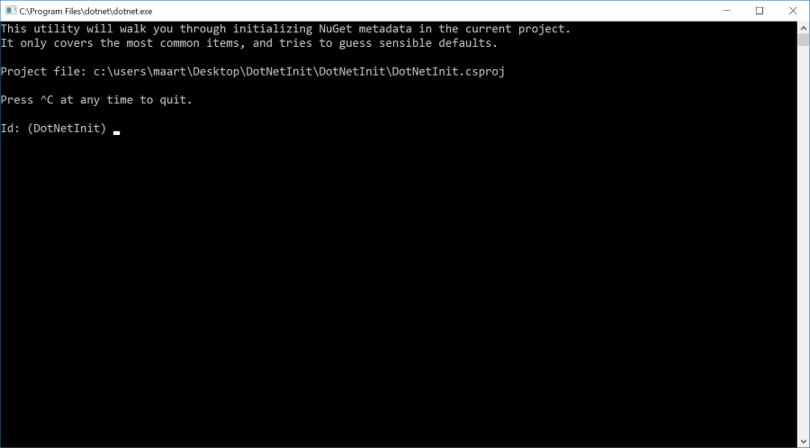

# dotnet-init

.NET CLI tool to initialize NuGet metadata in a .csproj file.

This utility will walk you through initializing NuGet metadata in the current project. It only covers the most common items, and tries to guess sensible defaults.

Full reference for NuGet properties in .csproj [is available from Microsoft](https://github.com/dotnet/docs/blob/master/docs/core/tools/csproj.md).

How to get it? [From NuGet of course!](https://www.nuget.org/packages/DotNetInit)

	Install-Package DotNetInit

Or from the `dotnet` CLI:

	dotnet add package DotNetInit

Or edit your `.csproj` and add:

	<ItemGroup>
		<DotNetCliToolReference Include="DotNetInit" Version="*" />
	</ItemGroup>
	
How to run it?

	dotnet init

